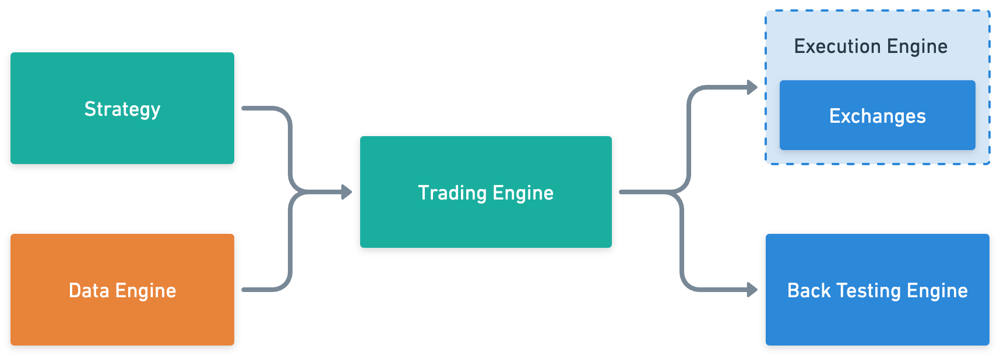

<div align="center">


<h4>terrace: an open source algorithmic trading engine optimized for a great developer experience</h4>

<h3>

[Home Page](https://github.com/carterjfulcher/terrace) | [Documentation](https://google.com) | [Discord](https://discord.gg/7NnvrG3Rt6) | [Examples](examples)

</h3>

[](https://github.com/carterjfulcher/terrace/stargazers)
[](https://github.com/carterjfulcher/terrace/actions/workflows/test.yaml)

</div>

<!-- ## Open source algorithmic trading engine, optimizing for a great developer experience. -->

---

_Terrace aims to remain near 1000 lines at the core, provide a flexible API, and great developer expereince._

Easily research, test, and deploy a variety of trading strategies across all asset classes.

## Core

- **Strategy** - Strategies are ambiguous to time and the asset they are trading against. They contain the rules for managing a portfolio
- **Data Engine** - The data engine is responsible for collecting data and supplying it to the strategy via the trading engine
- **Trading Engine** - The trading engine manages state and connects the data engine to the strategy, as well as enforces risk management rules.
- **Execution Engine** - The execution of trades is handled by the execution engine. The execution engine can send orders to exchanges asynchrnously in realtime.
- **Back Testing Engine** - The back testing engine is a wrapper around the data engine and execution engine, simulating trades over historical data.
<div align="center">
  
</div>

<!--  -->

## Install

The current recommended way to install Terrace is using pip:

```bash
pip install terrace-engine
```

## Demo

Creating a strategy is easy:

```python3
from terrace.strategy import Strategy
from terrace.helpers import ta

class TAStrategy(Strategy):
  def step(self, ctx):
    sma = ta.sma(ctx.close, 20)
    if ctx.close > sma:
      self.long()
    elif ctx.close < sma:
      self.short()
```

Implementing data is easy too, either from a paid vendor or your own sources:

```python3
from terrace.data import Context
from terrace.data import Intrinio, IEX, Polygon, CSV

custom_data = CSV('mydata.csv', columns=['price', 'change', 'bid', 'ask', 'customfield'])

context = Context(Intrinio(), IEX(), Polygon(), custom_data)

"""
>> print(context)

=== [ Providers ] ===
Intrinio, IEX, Polygon, CSV

=== [ Available Fields ] ===
(intrinio) close -> float*
(intrinio) open -> float*
(intrinio) high -> float*
...
(CSV) price -> float*
(CSV) change -> float*
(CSV) bid -> float*
(CSV) ask -> float*
(CSV) customfield -> string*

* indicates historical data is available

"""

```

With a Strategy, and data, back testing and live trading is possible:

```python3
""" Back Testing """
from terrace.trading import Backtest
from terrace.helpers import sp500constituents

engine = Backtest(strategy, context)
engine.run(frequency='1m', period='1mo', target=sp500contstuents)
#engine.plot()
#print(engine.stats())

""" Trade Live """
from terrace.trading import Engine
from terrace.execute import Alpaca

engine = Engine(strategy, context)
exchange = Alpaca(api_key=..., api_secret=...)

engine.run(frequency='1m', exchange=exchange, target='AAPL')

```
